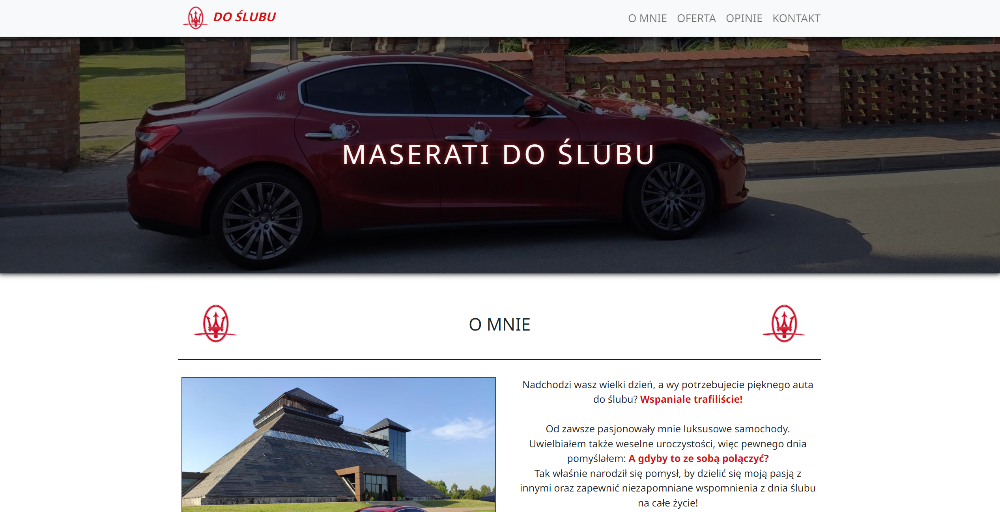
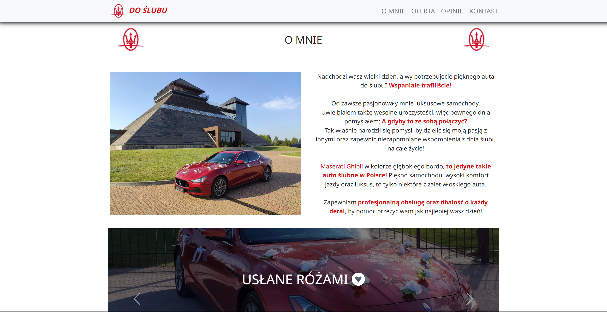

# Maserati Maserati for the wedding

**Hello!**

This is a project for a friend who needed a business card website for his business.
**The website was entirely designed and written by me (including the content)**.

On the website you can find out about my friend's business of transporting brides and grooms to their weddings.
As of today, this is how the site looks, but it is possible that there will be changes if that is what my friend wants.

On the page, you can select one of the offers, which will automatically tick in the contact form.
There are also all the links to social media, Google Maps etc.

The site is fully responsive. You can use it on larger as well as smaller resolutions.

## Screenshots

## 🔗 Live Site
[Live Site Here!](https://camillematernacci.github.io/Maserati/)

## 🛠 Technologies used

       

